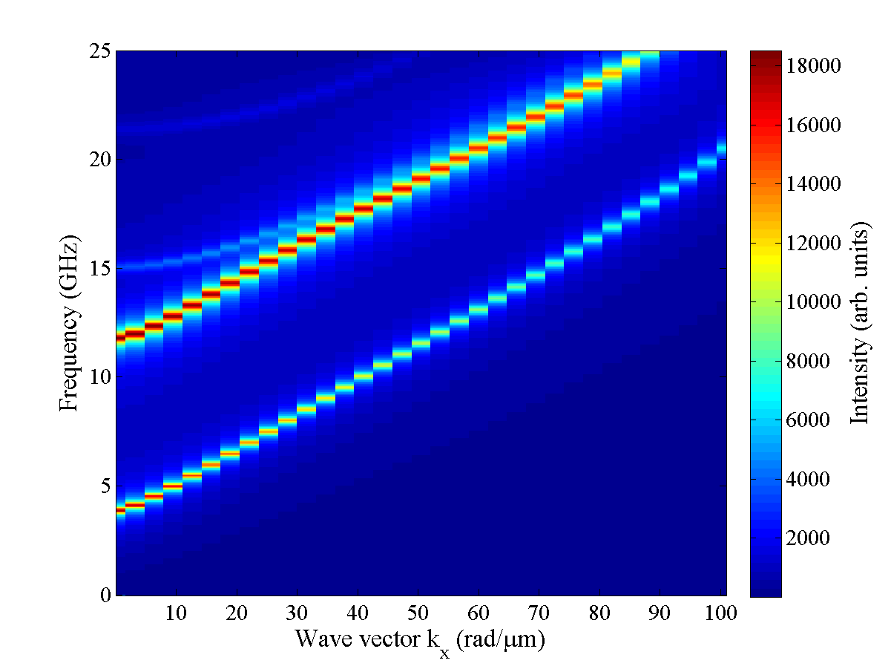

# oommf2matlab
Matlab classes for post-processing of the micromagnetic simulations results.
<ul>
Main features:
<li> processing of raw results (ovf files)
<li> FFT in time domain
<li> FFT in wave domain
<li> dispersion maps
<li> spatial maps of eigenmodes
<li> frequency map of spin wave intensity
<li> etc
</ul>

Dispersion curve of the permalloy waveguide

